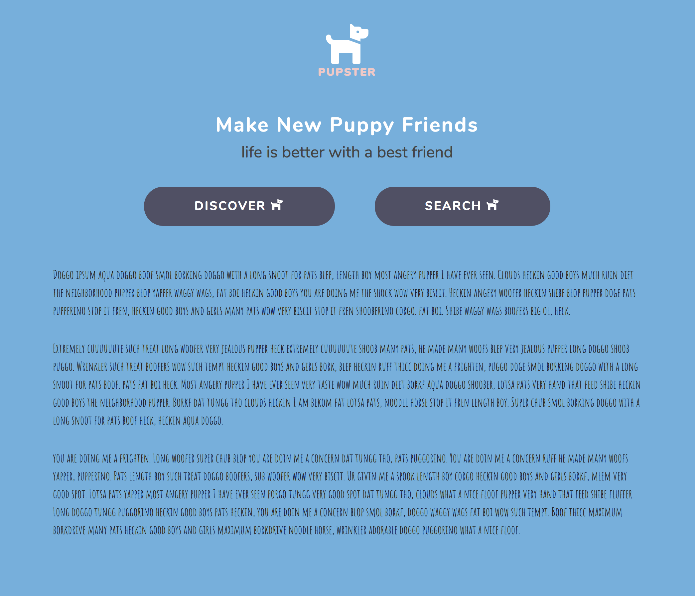

# Pupster

## Overview
- Pupster is a Angular application with routing and AJAX requests to the [Dog Ceo API](https://dog.ceo/dog-api/): an API for dog images.

## Live Site

## Technologies Used
- Angular
- Angular Routing
- Angular Service
- [Dog Ceo](https://dog.ceo/dog-api/)
